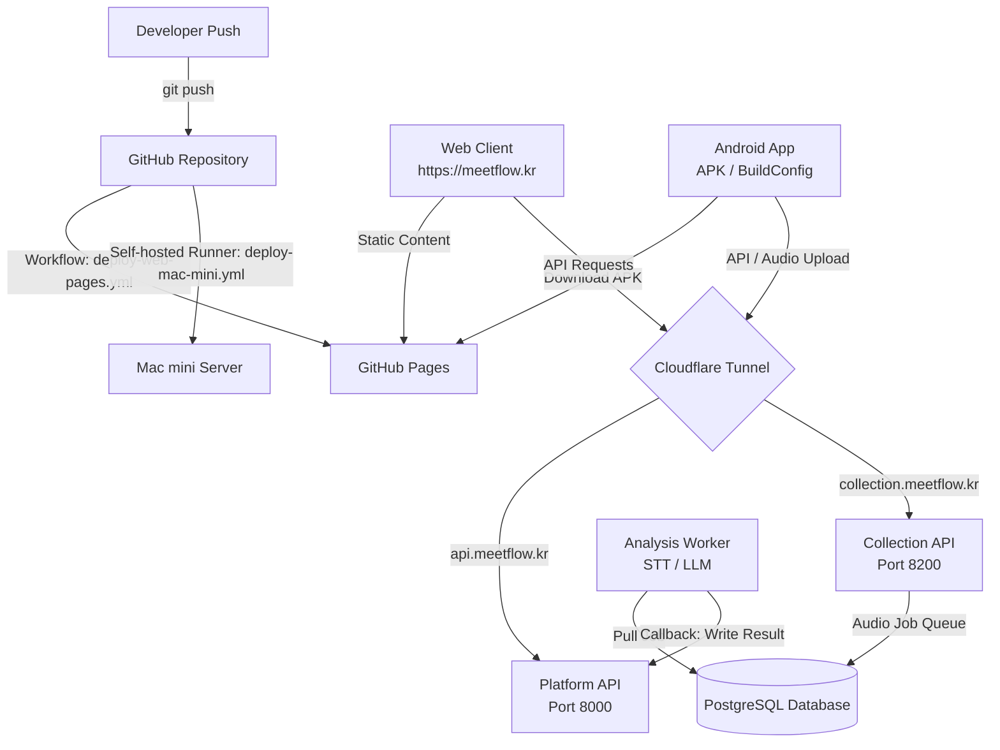

# AI-PMS Deployment and Integration Architecture

This document describes the unified Git deployment, network architecture, and App/Web integration structure for AI-PMS. Use this guide to understand how components connect and verify configuration settings during deployment.

---

## 1. Deployment and Network Topology

The architecture splits static client hosting (GitHub Pages) and dynamic API/compute processing (Mac mini) using Cloudflare tunnels and DNS routing.

---

## 2. Component Integration & Data Flow

When a meeting is recorded and analyzed, the system integrates the Android App, Collection API, Analysis Worker, Platform API, and Web Client as follows:

1. **Android App (Recording & Upload):**
   - The user records a meeting via the Android client.
   - The app sends the audio file to the Collection API (`https://collection.meetflow.kr/upload-sessions`).
2. **Collection API (Job Registration):**
   - Registers the upload session and saves the audio asset.
   - Creates an analysis job and writes it to the database queue.
3. **Analysis Worker (STT & LLM Processing):**
   - Runs in the background on the Mac mini.
   - Pulls pending jobs, runs STT transcription and LLM analysis.
   - Sends a callback to the Platform API (`https://api.meetflow.kr`) to write the draft analysis results.
4. **Platform API (PMS State Management):**
   - Updates the meeting status to `review_required`.
   - Manages projects, members, cost candidates, and review edits.
5. **Web Client (Review, Approval & Distribution):**
   - The reviewer logs in via `https://meetflow.kr` (communicating with `https://api.meetflow.kr`).
   - Edits and approves the meeting analysis package.
   - Platform automatically distributes the finalized minutes to project members via email.

---

## 3. Git-Based Deployment Pipeline

Pushing commits to the `user/heeseop` or `main` branches triggers two parallel workflows:

### A. Web Client (GitHub Pages)
- **Workflow:** `.github/workflows/deploy-web-pages.yml`
- **Output:** Built static files from `web_client/` are pushed to the `gh-pages` branch.
- **VITE_API_BASE:** Defaults to `https://api.meetflow.kr`. Can be customized via the `AIPMS_PLATFORM_URL` repository variable.
- **APK Hosting:** The Android debug APK is built locally and copied to `web_client/public/downloads/AI-PMS-Recorder.apk` via `scripts/publish_android_apk_download.sh`. The deployment pushes this static APK to GitHub Pages, providing a stable public download URL.

### B. Mac mini Server (Self-hosted Runner)
- **Workflow:** `.github/workflows/deploy-mac-mini.yml`
- **Runner:** Local GitHub runner running on the Mac mini (self-hosted, macOS).
- **Execution:** Runs `scripts/deploy_mac_mini_from_runner.sh --deploy` which:
  1. Synchronizes source code directories (excluding runtime data/venv).
  2. Builds virtual environments and updates Python dependencies.
  3. Applies database schemas.
  4. Launches background services in `screen` sessions (Platform, Collection, Analysis, Web dev server).
  5. Launches named Cloudflare tunnels.

---

## 4. Configuration Mapping Table

To ensure seamless integration, verify that configuration values are aligned across files:

| Config Variable | Target Component | Production Domain | Local/LAN Dev Target | Source File / Location |
| :--- | :--- | :--- | :--- | :--- |
| `VITE_API_BASE` | Web Client | `https://api.meetflow.kr` | `http://<LAN_IP>:8000` | `web_client/src/api/client.ts` |
| `aipmsPlatformBaseUrl` | Android App | `https://api.meetflow.kr` | `http://<LAN_IP>:8000` | `android_client/gradle.properties` |
| `aipmsCollectionBaseUrl` | Android App | `https://collection.meetflow.kr` | `http://<LAN_IP>:8200` | `android_client/gradle.properties` |
| `apk_url` | App Update | `https://meetflow.kr/downloads/AI-PMS-Recorder.apk` | `http://<LAN_IP>:3000/...` | `backend/app/main.py` (get manifest) |
| Ingress Hostname 1 | CF Tunnel | `meetflow.kr` | N/A | `scripts/setup_meetflow_named_tunnel.sh` |
| Ingress Hostname 2 | CF Tunnel | `api.meetflow.kr` | N/A | `scripts/setup_meetflow_named_tunnel.sh` |
| Ingress Hostname 3 | CF Tunnel | `collection.meetflow.kr` | N/A | `scripts/setup_meetflow_named_tunnel.sh` |

---

## 5. DNS and Cloudflare Configuration Checklist

When binding the custom domain `meetflow.kr`, prevent conflicts by configuring DNS settings in the Cloudflare dashboard as follows:

- [ ] **Disable quick tunnels (`trycloudflare.com`):** Only use named tunnels for production deployment to avoid temporary domain expiry.
- [ ] **Route Web traffic to GitHub Pages:**
  - Create a `CNAME` record for `meetflow.kr` pointing to `juyeoon.github.io`.
  - Create a `CNAME` record for `www` pointing to `juyeoon.github.io`.
- [ ] **Route API traffic to the Mac mini Tunnel:**
  - Create a `CNAME` record for `api` pointing to the Cloudflare Tunnel target.
  - Create a `CNAME` record for `collection` pointing to the Cloudflare Tunnel target.
- [ ] **CORS Settings:**
  - Ensure that the Platform API on the Mac mini allows requests from origin `https://meetflow.kr`.
- [ ] **Android Build Parameter Verification:**
  - When building the production APK, ensure it is built with production endpoints, or update `android_client/gradle.properties` to default to `https://api.meetflow.kr` and `https://collection.meetflow.kr`.
