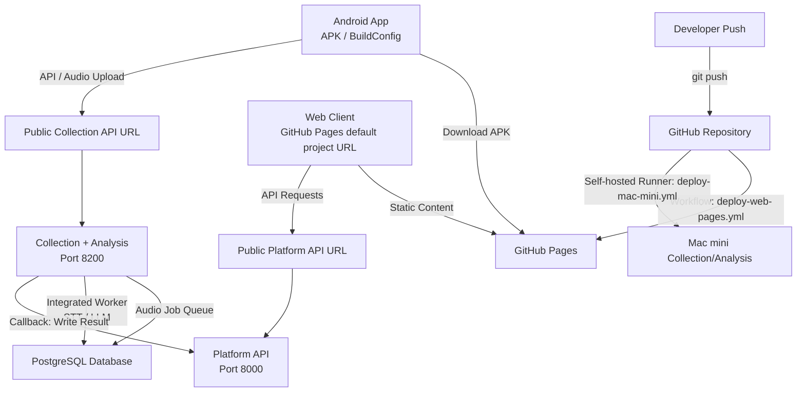

# AI-PMS Deployment and Integration Architecture

This document describes the Git deployment, network architecture, and App/Web
integration structure for AI-PMS. The current deployment standard uses GitHub
Pages default project hosting for Web and externally supplied public API URLs
for Mac mini services.

---

## 1. Deployment and Network Topology

The architecture splits static client hosting and dynamic API processing:

---

## 2. Component Integration & Data Flow

When a meeting is recorded and analyzed, the Android App, Collection API,
Analysis Worker, Platform API, and Web Client connect as follows:

1. **Android App (Recording & Upload):**
   - The user records a meeting via the Android client.
   - The app sends the audio file to the configured Collection API public URL.
2. **Collection API (Job Registration):**
   - Registers the upload session and saves the audio asset.
   - Creates an analysis job and writes it to the database queue.
3. **Integrated Analysis Worker (STT & LLM Processing):**
   - Runs as a background startup task inside `collection_api` on the Mac mini.
   - Pulls pending jobs, runs STT transcription and LLM analysis.
   - Sends a callback to the Platform API to write draft analysis results.
4. **Platform API (PMS State Management):**
   - Updates the meeting status to `review_required`.
   - Manages projects, members, cost candidates, and review edits.
5. **Web Client (Review, Approval & Distribution):**
   - The reviewer logs in through GitHub Pages Web.
   - The Web client communicates with the configured Platform API public URL.
   - Platform distributes finalized minutes to project members via email.

---

## 3. Git-Based Deployment Pipeline

Pushing commits to the deployment branch can trigger two workflows:

### A. Web Client (GitHub Pages)

- **Workflow:** `.github/workflows/deploy-web-pages.yml`
- **Output:** Built static files from `web_client/` are deployed to GitHub Pages.
- **API URL:** Set `AIPMS_PLATFORM_URL` as a GitHub repository variable.
- **Base Path:** Use `AIPMS_PAGES_BASE_PATH` when the repository path differs
  from `/llm-meeting-assistant/`.
- **APK Hosting:** The Android debug APK can be copied to
  `web_client/public/downloads/AI-PMS-Recorder.apk` via
  `scripts/publish_android_apk_download.sh`.

### B. Mac mini Collection/Analysis (Self-hosted Runner)

- **Workflow:** `.github/workflows/deploy-mac-mini.yml`
- **Runner:** Local GitHub runner running on the Mac mini.
- **Profile:** `AIPMS_DEPLOY_PROFILE=collection-analysis`
- **Execution:** Runs `scripts/deploy_mac_mini_from_runner.sh --deploy` which:
  1. Synchronizes Collection, scripts, contracts, docs, and model assets while
     preserving runtime data.
  2. Writes `PLATFORM_API_URL` to `collection_api/.env` when supplied by
     repository variables.
  3. Builds the Collection virtual environment and updates dependencies.
  4. Applies Collection schema migrations.
  5. Launches `aipms-collection` in a `screen` session.

---

## 4. Configuration Mapping Table

Verify that configuration values are aligned across files:

Production/public configuration must use the Platform server URL. Do not point
Mac mini Collection/Analysis, GitHub Pages Web, or public Android APK builds at
a PC/Mac mini LAN IP for Platform.

| Config Variable | Target Component | Public Target | Local/LAN Dev Target | Source File / Location |
| :--- | :--- | :--- | :--- | :--- |
| `VITE_API_BASE` | Web Client | `<platform-api-public-url>` | `http://<LAN_IP>:8000` | `web_client/src/api/client.ts` |
| `aipmsPlatformBaseUrl` | Android App | `<platform-api-public-url>` | `http://<LAN_IP>:8000` | `android_client/gradle.properties` |
| `aipmsCollectionBaseUrl` | Android App | `<collection-api-public-url>` | `http://<LAN_IP>:8200` | `android_client/gradle.properties` |
| `PLATFORM_API_URL` | Collection callback | `<platform-api-public-url>` | `http://<LAN_IP>:8000` | `collection_api/.env` |
| `apk_url` | App Update | `<github-pages-url>/downloads/AI-PMS-Recorder.apk` | `http://<LAN_IP>:3000/...` | `backend/app/main.py` |
| `AIPMS_PLATFORM_URL` | GitHub Pages workflow | `<platform-api-public-url>` | N/A | GitHub repository variables |

---

## 5. Public Access Checklist

- [ ] GitHub Pages is enabled with GitHub Actions deployment.
- [ ] `AIPMS_PLATFORM_URL` is set in repository variables.
- [ ] Platform API CORS allows `https://juyeoon.github.io`.
- [ ] Android public build receives Platform and Collection public URLs.
- [ ] Legacy Analysis `8100` is not exposed as a normal product endpoint.
- [ ] Collection `8200` health returns 200 and its integrated worker is enabled.
- [ ] Public API URLs are verified with `scripts/smoke_github_pages_cors.sh`
  and the continuous acceptance check.
